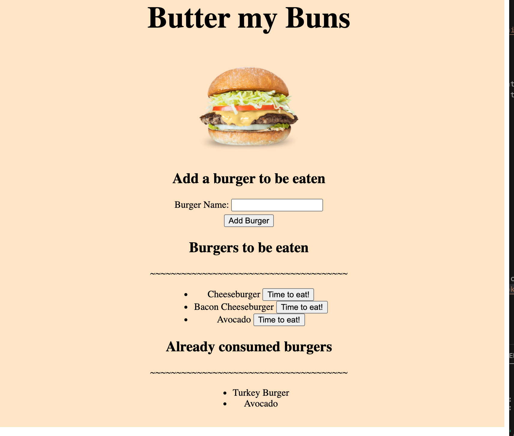
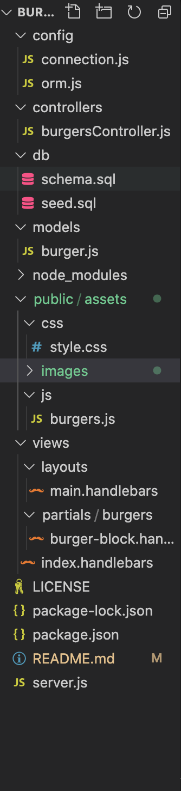
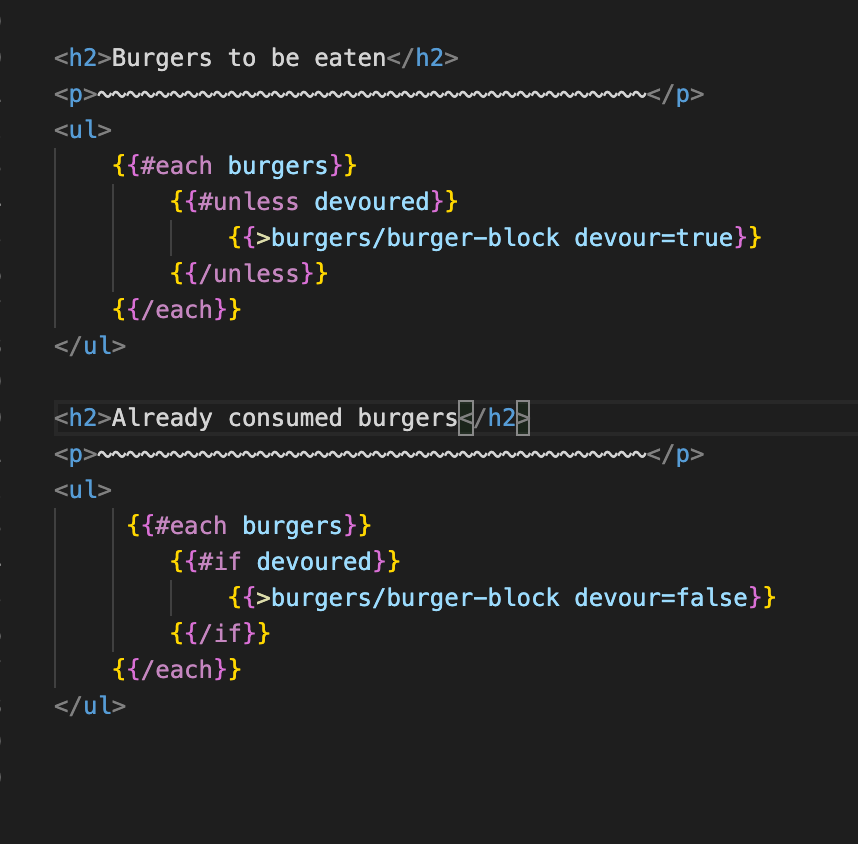

# Burger App
<hr>

[](https://opensource.org/licenses/MIT)

## Description

Website that keeps track of what burgers the user wishes to consume and responds to when the user clicks to eat the burger.



### Table of Contents

*[Usage](#usage)

*[Process](#process)

*[License](#license)

*[Contributing](#contributing)

*[Questions](#questions)


## Usage
 
To use the application, simply click on the deployed link. 
[https://still-ridge-23968.herokuapp.com/](https://still-ridge-23968.herokuapp.com/)

## Process

### Create Necessary Files

The below image shows all the necessary files for building this application



### Schema

First create a database and a table template that includes characteristics that may be necessary.
*The below code shows how this can be done*

```bash
CREATE DATABASE databasename;
USE databasename;

CREATE TABLE tablename
(
    ...
);
```
A seed is not necessary but may be nice to include for testing purposes.

### server.js and connection.js

These two files will be used to link to the website.
Method will not be detailed in this README as it has been covered in previous repositories.

### Making Template HTMLs Using Handlebars

#### main.handlebars

This is the main template for the HTML. Create head section of html and leave body mostly blank.

*By using the below code, the contents of body can be inputted later*
```bash
<body>
	{{{ body }}}
</body>
```

src tags can be added to this for further styling and functionality (js and css)

#### index.handlebars

This file will set the main contents of body for the website. It will fill the "body" portion of the HTML.

As seen in the main.handlebars file, there should be sections for later inputs within the index as well. Also by utilizing # a comparison can be called.

*The below image shows some implementations*



#### burger-block.handlebars

This file prints a list of burgers based on whether they have been consumed or not.

### Orm

Require the previously created connection.js file. Two initial functions are created to ease some processes that will be performed multiple times

- printQuestionMarks(num) takes in a number and adds that number of question marks to the query string

- objToSql(ob) takes the value in a colimn and concacts it and makes it readable for the query string

**Three main functions are defined to be used in a different file.**

- selectAll: This function takes the table and returns all values from the the table

- insertOne: This function inserts one row to the table by using putting together different elements called in the parameter of the function. These elements are used for the query string

- updateOne: This function takes a condition, finds the object that matches the condition, and changes its value(s)

### Controller

The controller file takes in express, router and a file called burger.js which will be explained later.

This file connects the handlebars with the burger.js file to insert appropriate elements.

By using the functions stated in the Orm section, it can pass in parameters from the HTML and give out a response.

### Model(burger.js)

This file connects Orm with the controller. It will define the functions stated in orm.js and preset the table formatting for desireable results.

## License

This Project is licensed under the MIT License

## Built With:
* [HTML](https://developer.mozilla.org/en-US/docs/Web/HTML)
* [JS](https://developer.mozilla.org/en-US/docs/Web/JS)
* [Node](https://developer.mozilla.org/en-US/docs/Web/API/Node)
* [SQL](https://developer.mozilla.org/en-US/docs/Glossary/SQL)


## Author(s):
**Brian Lee**
* [GitHub](https://github.com/brianjunhyuplee)
* [LinkedIn](https://www.linkedin.com/in/brian-lee-559208187/)


## Questions

If you have any questions about the repo, open an issue or contact me directly at [brianjunhyuplee@gmail.com](brianjunhyup@gmail.com). You can find more of my work at [brianjunhyuplee](https://github.com/brianjunhyuplee). 
    